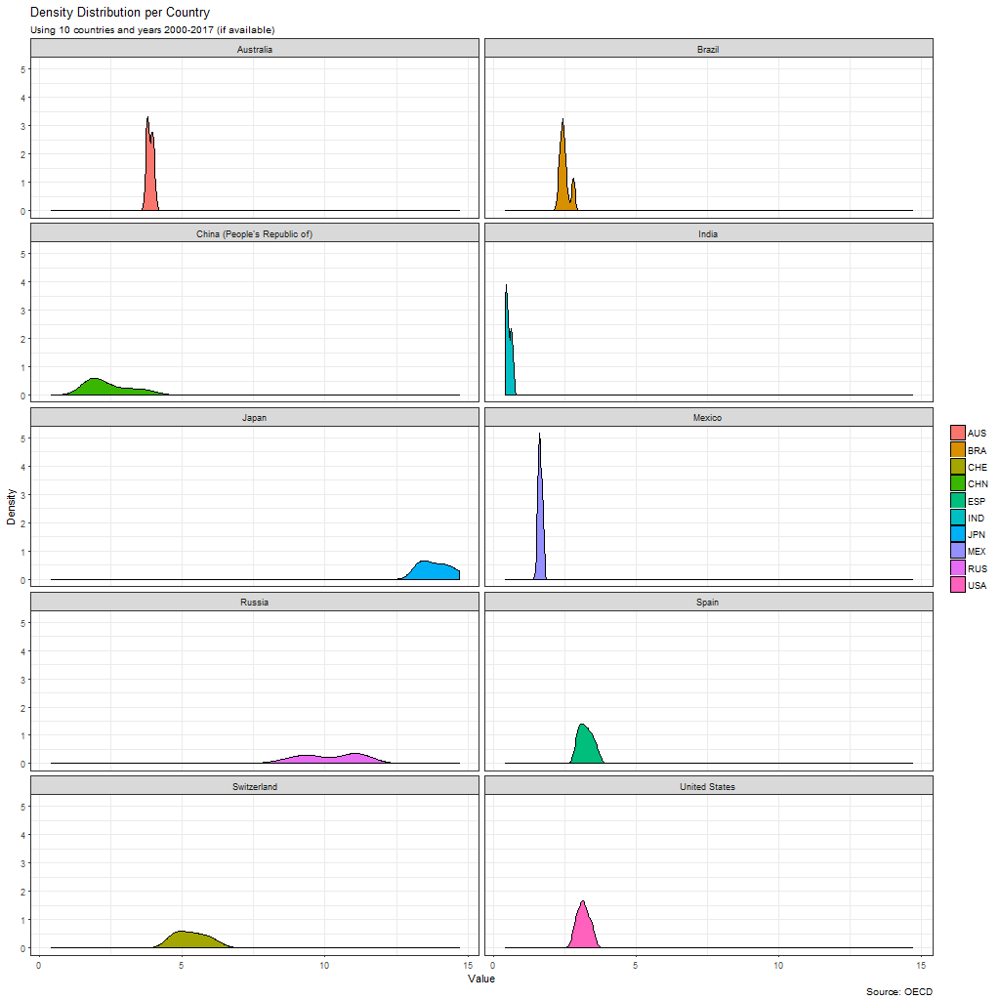
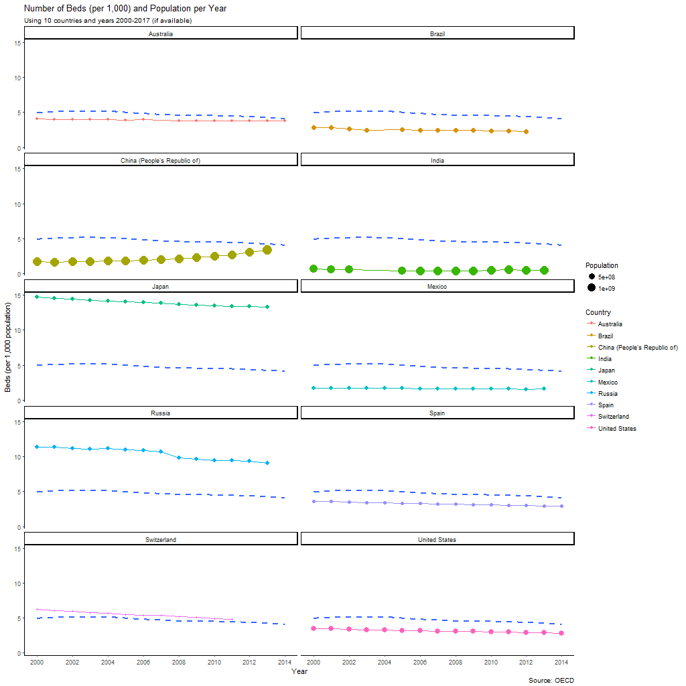

# 1. Introduction

In this study, we are going to build several plots to get a better understanding about healthcare around the world. Specifically, we are going to focus in the number of beds per country and year. Of course, it is not possible to directly compare those numbers without taking into account the population of such countries. That is why we are also going to use normalized data, which indicates the average number of beds per 1,000 population. That way, the comparison is fair.

Data has been obtained from The Organisation for Economic Co-operation and Development (OECD) [data portal](http://stats.oecd.org/#). Of course, this data has been already used and plotted by several websites and authors [[1]](https://www.indexmundi.com/g/r.aspx?v=2227) [[2]](https://www.indexmundi.com/facts/indicators/SH.MED.BEDS.ZS) [[3]](https://www.statista.com/chart/3696/the-countries-with-the-most-hospital-beds/), so we are going to try and obtain a new point of view. 

# 2. Data Extraction

```{r include=FALSE}
knitr::opts_chunk$set(cache=TRUE,fig.align='center',message=FALSE,warning=FALSE)	
rm(list = ls());gc()	
if (!require("pacman")) install.packages("pacman")	
pacman::p_load(ggplot2)	
```

First of all, we have to head into the [OECD data portal](http://stats.oecd.org/#) and download into a `.csv` file the data. Our data is in the directory `Health > Health Care Resources > Hospital Beds`, we are only going to download data regarding total beds and beds per 1,000 population. Now, we can load the downloaded data into R.
```{r}
beds <- read.csv(file="./BEDS.csv", header=TRUE, sep=",")
head(beds)
```

Alright, so it is visible that some of the fields are not going to be used, so we need to drop those columns. Besides that, we need to filter so only *Total Hospital Beds* are displayed.

```{r}
beds <- beds[beds$Variable=="Total hospital beds",]
beds$ï..VAR <- NULL
beds$Variable <- NULL
beds$UNIT <- NULL
beds$YEA <- NULL
beds$Flag.Codes <- NULL
beds$Flags <- NULL

head(beds)
```

#3. Data Visualization

## 3.1. Number of Beds Distribution for All Countries (A)

In our dataset, we contain data from many countries and many years, to be more specific:
```{r}
# Number of countries
length(unique(beds$COU))

# Years of data
length(unique(beds$Year))
```

So, we have 17 years of data from 43 different countries. If we want to display a facet, in which the comparison is going to be easier, we need to reduce the number of countries. We have decided to keep only ten countries, the most interesting ones (according to our criterion, which may not be the best one). The final list of countries is:
* Australia
* United States
* Mexico
* Brazil
* India
* China
* Japan
* Russia
* Switzerland
* Spain

Let's check the distribution if we aggregate all the data available.
```{r}
# filter the data
beds_10 <- beds[(beds$COU=="AUS" | beds$COU=="USA" | beds$COU=="IND" | beds$COU=="BRA" | beds$COU=="CHE" | beds$COU=="ESP" | beds$COU=="MEX" | beds$COU=="CHN" | beds$COU=="JPN" | beds$COU=="RUS"),]

# distrib plot
gg <- ggplot(beds_10[beds_10$Measure=="Per 1 000 population",], aes(x = Value))	
gg + geom_density(aes(col="red")) + 
     theme_classic() +
     theme(legend.position="none") + 
     labs(x="Value", 
          y="Density", 
          title="Density Distribution", 
          subtitle="Using 10 countries and years 2000-2017 (if available)", 
          caption="Source: OECD")
```

Alright, so we can see how most of the data is gathered around 2.5, but this graph is not very helpful. Let's plot the density distribution, but now we won't aggregate all the countries.

```{r}
gg + geom_density(aes(fill=COU)) + 
     theme_classic() + 
     theme(legend.title = element_blank()) + 
     labs(x="Value", 
          y="Density", 
          title="Density Distribution per Country", 
          subtitle="Using 10 countries and years 2000-2017 (if available)", 
          caption="Source: OECD")
```

Thanks to this graph, we can have a general vision of how related two countries are. The problem is that some countries are overlapping others, so it is not possible to have a clear look. To solve this problem, we are going to plot them using a facet.

```{r echo=T, results='hide'}
png(filename="dist_facet.png", width=1024, height=1024)

gg + geom_density(aes(fill=COU)) + 
     facet_wrap(~Country, nrow = 5) +
     theme_bw() + 
     theme(legend.title = element_blank()) + 
     labs(x="Value", 
          y="Density", 
          title="Density Distribution per Country", 
          subtitle="Using 10 countries and years 2000-2017 (if available)", 
          caption="Source: OECD")

dev.off()
```
*NOTE: I've chosen to convert the plot into .png and display the image so that visibility is improved.*


We can observe two different trends: the first one presents a high and thin distribution, whereas the other trend is characterized by low and flat distributions. High and thin distributions means that the number of beds (per 1,000 population) has been the same for the recorded years. Australia, Brazil, India and Mexico are the most significant countries of this kind. On the other hand, low and flat ones indicate that the number of beds has changed significantly during the years. This behaviour can be seen in China, Japan, Russia and Switzerland. Finally, we have Spain and United States which are somewhere in the middle of those trends.


It is also possible to visualize that Japan is way above the average, followed by Russia and Switzerland. Then, we have the other countries which have similar values, excluding India, which is the worst country of the consulted ones.

## 3.2. Evolution of Number of Beds as a function of Time (B)

Another fact to take into account is the trend of each country as time goes. Now, we are going to plot the data as a function of time, so we can see if the number of beds is stable, decreasing or increasing for each country.

```{r}
# filter the data
beds_10 <- beds[(beds$COU=="AUS" | beds$COU=="USA" | beds$COU=="IND" | beds$COU=="BRA" | beds$COU=="CHE" | beds$COU=="ESP" | beds$COU=="MEX" | beds$COU=="CHN" | beds$COU=="JPN" | beds$COU=="RUS"),]

# distrib plot
gg <- ggplot(beds_10[beds_10$Measure=="Per 1 000 population",], aes(x = Year, y=Value))	
gg + geom_line(aes(col=COU), size=1) + 
     theme_classic() +
     labs(x="Year", 
          y="Beds (per 1,000 population)", 
          title="Number of Beds as a function of Time", 
          subtitle="Using 10 countries and years 2000-2017 (if available)", 
          caption="Source: OECD")
```

Overall, we can observe a decreasing trend for all countries except China, which is the only one increasing every year since 2003. This is perfectly correlated with the world situation for the last decade, while most of the countries economies are stopped or decreasing, China is emerging as one of the most powerful economies in the world. The increased value of China's economy has a direct impact in healthcare (in our case in hospital beds), as citizens are expected to live longer.

If we take a look at the same results, but applying a smoothing average we've got:

```{r}
# distrib plot
gg <- ggplot(beds_10[beds_10$Measure=="Per 1 000 population",], aes(x = Year, y=Value))	
gg + geom_line(aes(col=COU)) + 
     geom_smooth(method = "auto", size=3) +
     theme_classic() +
     labs(x="Year", 
          y="Beds (per 1,000 population)", 
          title="Number of Beds as a function of Time + Smoothing Average", 
          subtitle="Using 10 countries and years 2000-2017 (if available)", 
          caption="Source: OECD")
```

Now, this plot reveals something very interesting. While the global trend is a decreasing one, the smoothing average increases in the last years, why? This happens because China is growing so fast that it compensates the static or decreasing trend of the other countries. We can also add that the average number of beds is 5, but this number is skewed, as all countries are below it, excluding Japan and Russia.

If we facet the data to observe each country individually, we get:
```{r echo=T, results='hide'}
png(filename="year_facet.png", width=1024, height=1024)

# This lines are used to select the dataframe without the faceting variable
# This way, we can display the smoothing average in each facet
excluded_facet_var <- names(beds_10) %in% c("Country") 
beds_10_no_facet <- beds_10[!excluded_facet_var]
beds_10_no_facet <- beds_10_no_facet[beds_10_no_facet$Measure=="Per 1 000 population",]

gg + geom_line(aes(col=COU), size=2) + 
     facet_wrap(~Country, nrow = 5) +
     geom_smooth(data = beds_10_no_facet, se = FALSE, linetype = "dashed") +
     theme_bw() + 
     theme(legend.title = element_blank()) + 
     labs(x="Year", 
          y="Beds (per 1,000 population)", 
          title="Number of Beds as a function of Time + Smoothing Average", 
          subtitle="Using 10 countries and years 2000-2017 (if available)", 
          caption="Source: OECD")

dev.off()
```


Basically, it confirms what we said some lines above. We can observe how almost all countries are below the average (which is the blue dotted line), while Japan and Russia are way above it.

# 4. Building a Bubble Plot

To finish this brief analysis, we are going to build a bubble plot, inspired by [the mother of them all](https://www.gapminder.org/tools/#$chart-type=bubbles). In this case, we also need the population of each country per year, so we are going to obtain it using, once again, the [OECD data portal](http://stats.oecd.org/#).

```{r}
population <- read.csv(file="./POPULATION.csv", header=TRUE, sep=",")
head(population)
```

Let's filter the population data, so we only keep those countries which we are currently studying.

```{r}
pops_10 <- population[population$ï..LOCATION=="AUS" | population$ï..LOCATION=="USA" | population$ï..LOCATION=="IND" | population$ï..LOCATION=="BRA" | population$ï..LOCATION=="CHE" | population$ï..LOCATION=="ESP" | population$ï..LOCATION=="MEX" | population$ï..LOCATION=="CHN" | population$ï..LOCATION=="JPN" | population$ï..LOCATION=="RUS",]

pops_10$SUBJECT <- pops_10$Subject <- pops_10$SEX <- pops_10$Sex <- pops_10$FREQUENCY <- pops_10$Frequency <- pops_10$TIME <- pops_10$Unit.Code <- pops_10$Unit <- pops_10$PowerCode.Code <- pops_10$PowerCode <- pops_10$Reference.Period.Code <- pops_10$Reference.Period <- pops_10$Flag.Codes <- pops_10$Flags <- pops_10$ï..LOCATION <- NULL

colnames(pops_10)[2]  <- "Year"

#mydata <- merge(mydata1, mydata2, by=c("country","year")) 

head(pops_10)
```

If we want to work with both the number of beds and the population, we need to merge both dataframes. This way, the later visualization with `ggplot` is going to be way easier.

```{r}
# Merge by country and year
bed_pop_10 <- merge(beds_10, pops_10, by=c("Country","Year")) 

# Both datasets had a "value" field, now they are called "value.x" and "value.y", we rename to something better
colnames(bed_pop_10)[5]  <- "Beds"
colnames(bed_pop_10)[6]  <- "Population"

head(bed_pop_10)
```


Alright, now that we have the needed data, we can start plotting!
```{r}
gg <- ggplot(bed_pop_10[bed_pop_10$Measure=="Per 1 000 population",], aes(x = Year, y = Beds))	
gg + geom_point(aes(col=Country, size=Population)) +  
     geom_line(aes(col=Country)) +
     stat_smooth(se = FALSE) +
     theme_classic() +
     scale_x_continuous(breaks = pretty(bed_pop_10$Year, n = 5)) +
     scale_y_continuous(breaks = pretty(bed_pop_10[bed_pop_10$Measure=="Per 1 000 population",]$Beds, n = 10)) +
     #theme(legend.position="none") + 
     labs(x="Year", 
          y="Beds (per 1,000 population)", 
          title="Number of Beds (per 1,000) and Population per Year", 
          subtitle="Using 10 countries and years 2000-2017 (if available)", 
          caption="Source: OECD")
```

Finally, we are going to obtain a better view of each country related to the smoothing average of all of them. To achieve that, we are going to apply a facet, so that each country is displayed independently.
```{r}
png(filename="bubble_facet.png", width=1024, height=1024)

# This lines are used to select the dataframe without the faceting variable
# This way, we can display the smoothing average in each facet
excluded_facet_var <- names(bed_pop_10) %in% c("Country") 
bed_pop_10_no_facet <- bed_pop_10[!excluded_facet_var]
bed_pop_10_no_facet <- bed_pop_10_no_facet[bed_pop_10_no_facet$Measure=="Per 1 000 population",]

gg <- ggplot(bed_pop_10[bed_pop_10$Measure=="Per 1 000 population",], aes(x = Year, y = Beds))	
gg + geom_point(aes(col=Country, size=Population)) + 
     geom_line(aes(col=Country)) +
     facet_wrap(~Country, nrow = 5) +
     geom_smooth(data = bed_pop_10_no_facet, se = FALSE, linetype = "dashed") +
     theme_classic() +
     scale_x_continuous(breaks = pretty(bed_pop_10$Year, n = 5)) +
     scale_y_continuous(breaks = pretty(bed_pop_10[bed_pop_10$Measure=="Per 1 000 population",]$Beds, n = 5)) +
     #theme(legend.position="none") + 
     labs(x="Year", 
          y="Beds (per 1,000 population)", 
          title="Number of Beds (per 1,000) and Population per Year", 
          subtitle="Using 10 countries and years 2000-2017 (if available)", 
          caption="Source: OECD")

dev.off()
```



# 5. Conclusions

In this exploratory analysis, we have built several plots. The objective of those plots is to describe as many information as possible in an understable manner. Thanks to this, we are able to obtain better insights of the data. 

In our case, we have been able to study the trends of the selected countries, in terms of beds per habitant. This relationship can be used to explain the development of those countries, as well as the wealth linked to them. Surprisingly, among the 10 chosen countries, Russia is the second one in the list, only behind of Japan. I would have expected Russia to be lower, but turns out it isn't the case. As the general trend is to decrease the number of beds, China is doing the opposite, their numbers can't stop increasing. This is heavily linked to the growth of China as one of the top economies of the world, so it's reflected on other aspects (such as the number of beds!).

*[This was presented as an assignment for *Network analysis and data visualization*, course taught by [Esteban Moro](https://twitter.com/estebanmoro) and part of [UC3M's Master in Big Data Analytics](https://www.uc3m.es/ss/Satellite/Postgrado/en/Detalle/Estudio_C/1371210340413/1371219633369/Master_in_Big_Data_Analytics)]*
